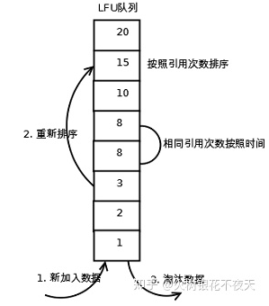
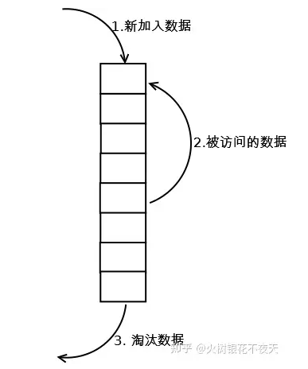
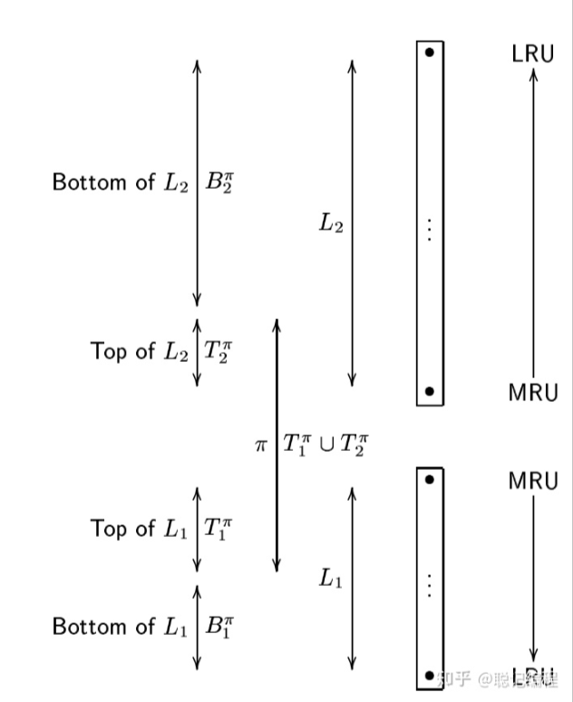
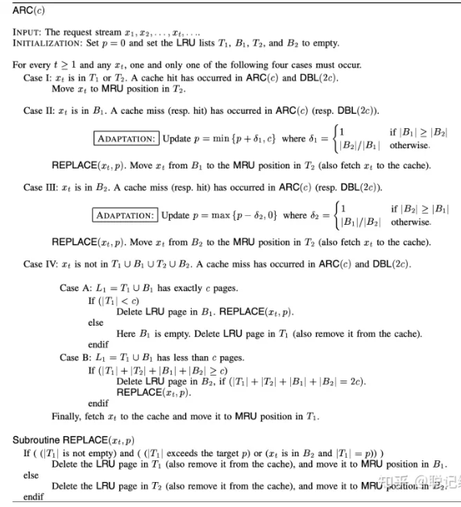
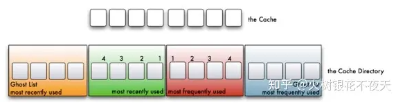
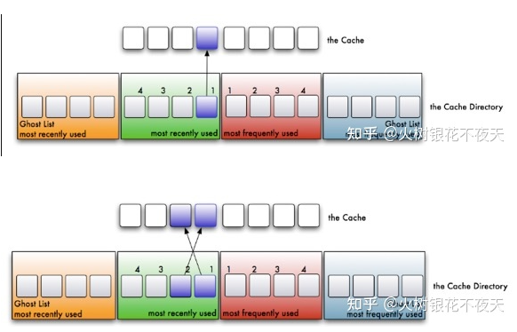
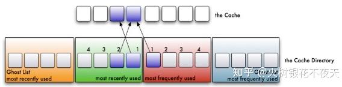
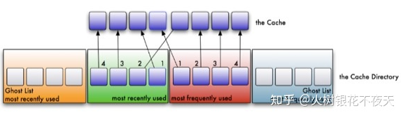
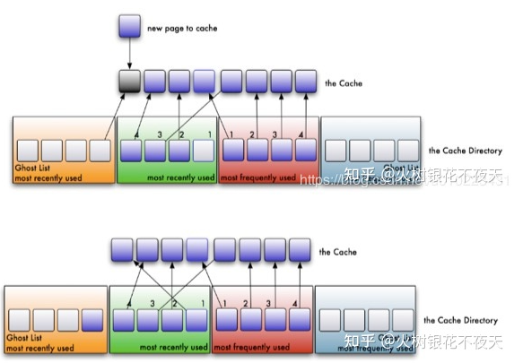
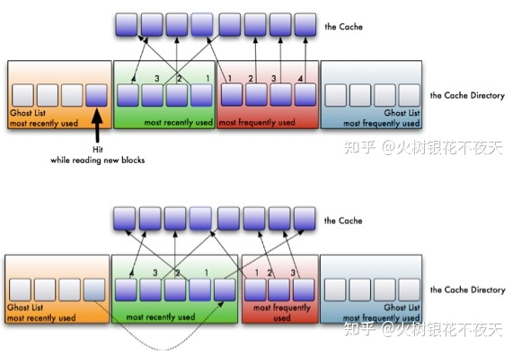

# Cache-Replacement-Policy
## 缓存替换策略 C#实现（Cache Replacement Policy）

---
常用缓存替换策略及C#实现

- <strong>1.LFU：(Least Frequently Used)最近最不常用算法,根据数据的历史访问频率来淘汰数据</strong>

    核心思想是：最近使用频率高的数据很大概率将会再次被使用,而最近使用频率低的数据,很大概率不会再使用。

    做法：把使用频率最小的数据置换出去。这种算法是完全从使用频率的角度去考虑的。

    ### 执行过程理解:

    

    1.在缓存中查找客户端需要访问的数据

    2.如果缓存命中，则将访问的数据从队列中取出，并将数据对应的频率计数加1，然后将其放到频率相同的数据队列的头部，比如原来是A(10)->B(9)->C(9)->D(8),D被访问后，它的time变成了9，这时它被提到A和B之间，而不是继续在C后面

    3.如果没有命中，表示缓存穿透，将需要访问的数据从磁盘中取出，加入到缓存队列的尾部，记频率为1，这里也是加入到同为1的那一级的最前面
    
    4.如果此时缓存满了，则需要先置换出去一个数据，淘汰队列尾部频率最小的数据，然后再在队列尾部加入新数据。

    <strong>存在的问题：</strong>

    某些数据短时间内被重复引用，并且在很长一段时间内不再被访问。由于它的访问频率计数急剧增加，即使它在相当长的一段时间内不会被再次使用，也不会在短时间内被淘汰。这使得其他可能更频繁使用的块更容易被清除，此外，刚进入缓存的新项可能很快就会再次被删除，因为它们的计数器较低，即使之后可能会频繁使用。

- <strong>2.LRU（Least Recently User） 最近最少使用算法,根据数据的历史访问记录来进行淘汰数据</strong>

    核心思想是：最近使用的数据很大概率将会再次被使用。而最近一段时间都没有使用的数据，很大概率不会再使用。

    做法：把最长时间未被访问的数据置换出去。这种算法是完全从最近使用的时间角度去考虑的。

    ### 执行过程理解:

    

    1.在缓存中查找客户端需要访问的数据 如果缓存命中，则将访问的数据中队列中取出，重新加入到缓存队列的头部。

    2.如果没有命中，表示缓存穿透，将需要访问的数据从磁盘中取出，加入到缓存队列的尾部；

    3.如果此时缓存满了，淘汰队列尾部的数据，然后再在队列头部加入新数据。

    <strong>存在的问题：</strong>

    缓存污染：如果某个客户端访问大量历史数据时，可能使缓存中的数据被这些历史数据替换，其他客户端访问数据的命中率大大降低。

- <strong>3.Adaptive Replacement Cache(ARC) 自适应缓存替换算法,它结合了LRU与LFU,来获得可用缓存的最佳使用。</strong>

    
    

    核心思想是：当时访问的数据趋向于访问最近的内容，会更多地命中LRU list，这样会增大LRU的空间； 当系统趋向于访问最频繁的内容，会更多地命中LFU list，这样会增加LFU的空间.

    执行过程理解:
    
    1. 整个Cache分成两部分，起始LRU和LFU各占一半，后续会动态适应调整partion的位置（记为p）除此，LRU和LFU各自有一个ghost list(因此，一共4个list)
    
    2. 在缓存中查找客户端需要访问的数据， 如果没有命中，表示缓存穿透，将需要访问的数据 从磁盘中取出，放到LRU链表的头部。
    
    3. 如果命中，且LFU链表中没有，则将数据放入LFU链表的头部，所有LRU链表中的数据都必须至少被访问两次才会进入LFU链表。如果命中，且LFU链表中存在，则将数据重新放到LFU链表的头部。这么做，那些真正被频繁访问的页面将永远呆在缓存中，不经常访问的页面会向链表尾部移动，最终被淘汰出去。
    
    4. 如果此时缓存满了，则从LRU链表中淘汰链表尾部的数据，将数据的key放入LRU链表对应的ghost list。然后再在链表头部加入新数据。如果ghost list中的元素满了，先按照先进先出的方式来淘汰ghost list中的一个元素，然后再加入新的元素。
    
    这里注意上面的the cache才是实际的LRU和LFU结合的链表，因此是删除了LRU链表的尾部元素，尾部元素对应下面的位置索引是1。
    
    5. 如果没有命中的数据key处于ghost list中，则表示是一次幽灵（phantom）命中，系统知道，这是一个刚刚淘汰的页面，而不是第一次读取或者说很久之前读取的一个页面。ARC用这个信息来调整它自己，以适应当前的I/O模式（workload）。
    
    这个迹象说明我们的LRU缓存太小了。在这种情况下，LRU链表的长度将会被增加1，并将命中的数据key从ghost list中移除，放入LRU链表的头部。显然，LFU链表的长度将会被减少1。
    
    同样，如果一次命中发生在LFU ghost 链表中，它会将LRU链表的长度减一，以此在LFU 链表中加一个可用空间。
    